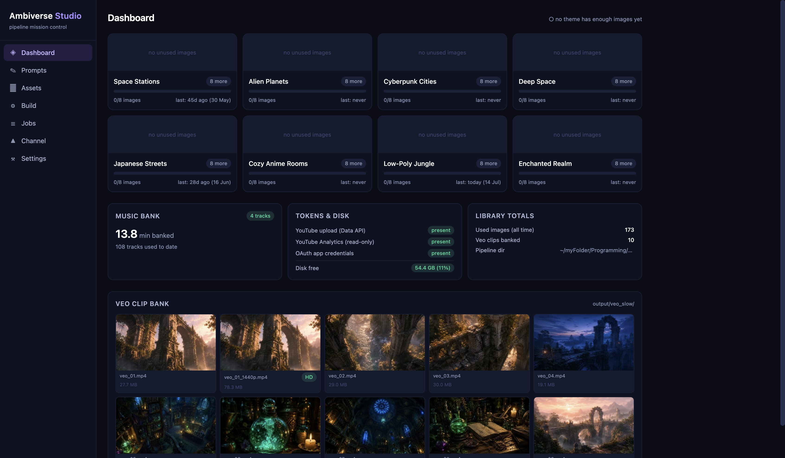
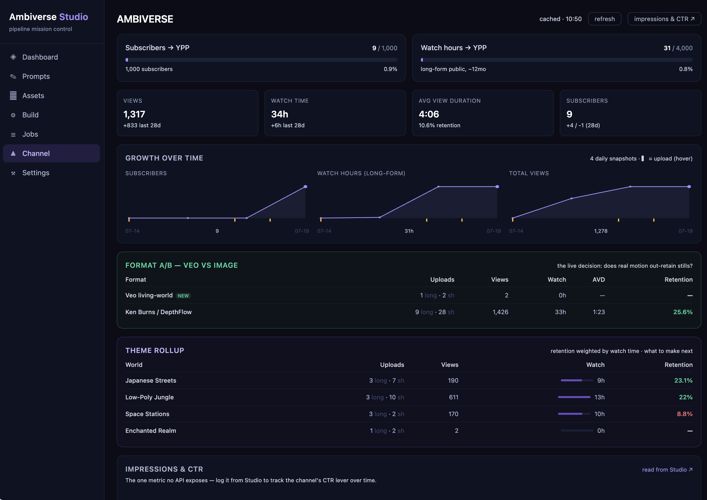
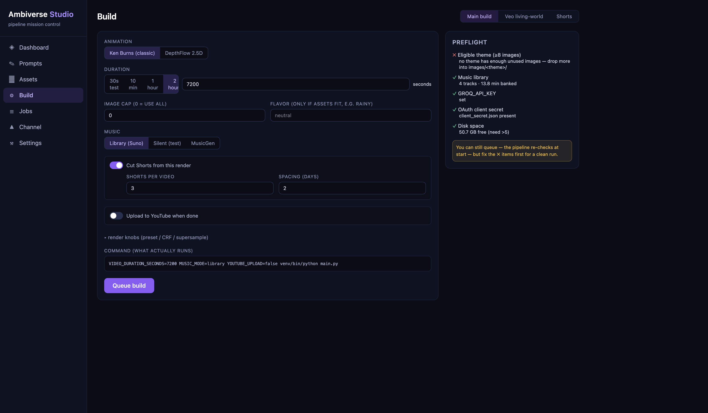

# Ambiverse Studio

**Local mission-control web app for an AI YouTube pipeline** — one browser UI to run everything, instead of ~20 CLI scripts and a wall of environment variables.

It drives the [Ambiverse](https://www.youtube.com/@ambiverseworlds) ambient-music pipeline: a Python system that assembles AI-generated images + music into 2-hour immersive videos (Ken Burns · DepthFlow 2.5D · Veo "living-world" slow-motion), auto-generates metadata and thumbnails, and uploads to YouTube. Studio wraps that pipeline — it never reimplements it — and adds the things a pile of scripts can't give you: a live view of pipeline state, a job queue with streaming logs, media browsing, and real channel analytics.

> **Stack:** FastAPI (Python) on `127.0.0.1:4700` · React + Vite + TypeScript + Tailwind (dev `:5175`). No ORM, no state library beyond React Query, no charting dependency — SQLite and inline SVG do the work.

---

## Screenshots

<!-- Add the three hero shots to docs/screenshots/ and uncomment:
| Dashboard | Channel analytics | Build wizard |
|---|---|---|
|  |  |  |
-->

A dark "Dusk" control panel: per-theme readiness cards, a job queue with live logs, a media browser, and a channel-analytics tab with a per-world retention rollup.

## What it does

| Page | What it gives you |
|---|---|
| **Dashboard** | The "can I build today?" view — per-theme image readiness vs the eligibility gate, music bank, Veo clip bank (with poster frames), token/disk status, and a running-job banner. |
| **Prompts** | One click runs the daily prompt generator as a job (live log inline); each theme renders as copy-ready blocks so one button copies `style + scene + variation` straight into an image model. |
| **Assets** | Per-theme image grid with display-time warnings (aspect ratio, dupes), in-browser music playback, and an outputs browser with `<video>` preview over HTTP range requests. Safe actions: trash → recoverable, set-as-thumb. |
| **Build** | Wizards that assemble the env + command, **show the exact command that will run**, run an inline preflight, then queue it: a main build (Ken Burns / DepthFlow, every knob), a Veo enhance→assemble flow, and a Shorts builder. |
| **Jobs** | SQLite-backed queue, live log streaming (SSE), progress parsing, and **cancel that kills the whole process group** (ffmpeg/RIFE children included). Single-flight so heavy renders never overlap. |
| **Channel** | YouTube analytics that answer a question, not just dump numbers: YPP progress bars, lifetime + 28-day overview, a **per-world retention rollup** ("what should I make next"), traffic/geo/device breakdowns, scheduled-publish list, plus local growth-over-time charts and a manual impressions/CTR log for the one metric no API exposes. |
| **Settings** | Paths, live pipeline defaults, token status with one-click re-auth launchers, and the theme registry rendered from the pipeline's own config. |

## Architecture notes

- **Wrap, don't rewrite.** Studio spawns the pipeline's *existing* scripts as subprocess jobs, with the pipeline's own venv interpreter and the same env-var knobs the CLI uses. Zero pipeline logic is duplicated; the pipeline stays 100% usable without Studio.
- **The pipeline is a dependency, not a submodule.** Its path is configured via `.env`; Studio reads its folders and imports its `config.py` for the source-of-truth theme registry, but never writes into it except by running its scripts.
- **Job engine.** One worker drains a SQLite queue; jobs spawn in their own process group (`start_new_session=True`) wrapped in `caffeinate` so sleep can't kill a render; cancel is `SIGTERM`→grace→`SIGKILL` on the group; logs stream to the browser over SSE.
- **Analytics collector runs under the pipeline's venv.** The channel collector needs the pipeline's Google API libraries, so Studio runs it as a subprocess under that interpreter, reuses the pipeline's own analytics helpers, and caches results with a 1-hour TTL to stay quota-friendly.
- **Localhost only, secrets-safe.** Binds `127.0.0.1`, no auth, no deploy. Tokens are shown as *status* only — never contents; media serving is extension-gated to the pipeline directory so credential files can't leak; destructive ops move to a recoverable trash rather than `rm`.

## Run

```bash
# 1. Backend (FastAPI on :4700)
python3.12 -m venv server/venv
server/venv/bin/pip install -r server/requirements.txt
cp .env.example .env          # point ANIMEMBIENT_DIR at the pipeline
server/venv/bin/uvicorn app:app --app-dir server --port 4700 --reload

# 2. Frontend (Vite dev server on :5175, proxies /api → :4700)
npm install --prefix web
npm run dev --prefix web
```

Then open `http://localhost:5175`. In production the backend also serves the built SPA on `:4700`.

---

*Built as a full-stack portfolio piece — a real control plane for a real AI media pipeline. The pipeline it drives lives in a separate private repository.*
